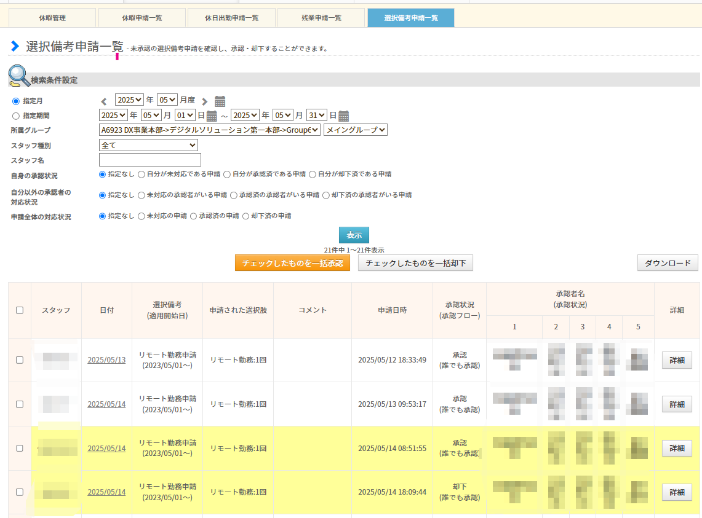

# Jobcan Check Helper

TL/GM業務の手助けになることを目的としたジョブカンを見やすくする拡張機能です。
※あくまで手助けなので使用と結果の正しさは各自の責任でお願いします。

## 機能

1. リモート勤務申請の日付ハイライト機能

## リモート勤務申請の日付ハイライト機能

リモート勤務申請の場合に、申請日時が対象日付の前日19時以降の場合、その行を色付けします。  

## 適用方法

1. リポジトリをクローンします: `git clone https://github.com/your-username/jobcan-check-helper.git` (zipのダウンロードでも可能)
2. Chromeを開き、`chrome://extensions/`にアクセスします。
3. 右上にある「デベロッパーモード」を有効にします。
4. 「パッケージされていない拡張機能を読み込む」をクリックし、クローンしたリポジトリのディレクトリを選択します。
5. これで拡張機能がインストールされ、拡張機能リストに表示されます。
